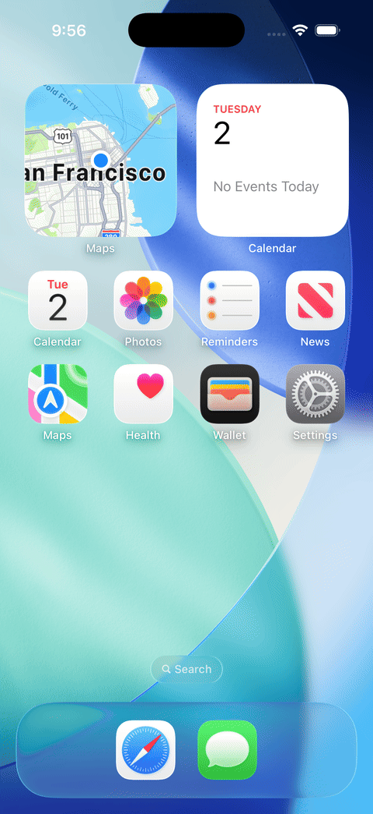

# SIBB

**Smartphone Interaction Benchmark for Bots** — a reproducible iOS benchmark
for LLM agents, with **database-level ground truth** and **three matched
baselines** (UI, API, hybrid).

SIBB runs LLM agents on multi-step tasks across iOS's built-in apps. Actions
go through Apple's XCUITest framework; verification reads ground truth from
the underlying data stores — EventKit, sqlite, PhotoKit, Maps' rstorage,
Contacts.framework — never from a VLM judge. Tasks are procedurally
generated with seedable distractor noise, so the corpus remains a moving
target after release.

### Headline (gemini-2.5-flash, single seed)

| Class | n | API baseline | UI baseline | Δ |
|---|---|---|---|---|
| `api_only` | 19 | **15/19 = 79%** | 7/19 = 37% | API +42pp |
| `ui_only` | 7 | 0/7 = **0%** | 3/7 = 43% | UI +43pp |
| **Total** | **26** | **15/26 = 58%** | **10/26 = 38%** | API +20pp |

The two zero cells are the paper-relevant story: `0%` API on `ui_only` is the
platform-ceiling claim (the API surface contains no call sequence that mutates
the verifier-checked state); `0` `only_ui` on `api_only` is the strict-API
efficiency claim (when both can succeed, the API path always wins). Per-task
contingency and reproduction commands are in
[`api_baseline/results/RUNS.md`](api_baseline/results/RUNS.md).

---

## See it run

Gemini 2.5 Flash on the iOS Simulator, real-time playback (3 fps). Both
episodes are unedited runs of the UI baseline; the second-row caption shows
the verbatim instruction the agent received and the verifier outcome.

<table>
<tr>
<td width="50%" align="center"><b>Complete a reminder</b></td>
<td width="50%" align="center"><b>Create a calendar event</b></td>
</tr>
<tr>
<td></td>
<td></td>
</tr>
<tr>
<td><i>"Open Reminders. 'Update roadmap' is done — check it off."</i></td>
<td><i>"Open Calendar. Create an event titled 'Date Night' tomorrow from 3pm to 3:45pm."</i></td>
</tr>
<tr>
<td align="center"><sub>5 steps · verifier PASS</sub></td>
<td align="center"><sub>16 steps · verifier PASS</sub></td>
</tr>
</table>

These are two successful episodes from the headline run above. The UI
baseline's full-corpus pass rate is 38% (10/26) — these gifs are not
representative of typical behaviour.

---

## What's in the box

- **77 procedural task generators** across the iOS-26.3 simulator's
  installed apps — Reminders, Calendar, Contacts, Files, Maps, Safari,
  Messages, Photos, Health, Settings, Shortcuts
- **Cross-app workflows** like `Messages → Contacts → Maps` (parse the
  address out of a message, save it to a contact, get directions)
- **Database-backed verifier** with 13 named check kinds (`exists`,
  `count`, `attribute_eq`, `attribute_set_contains`, `time_within`,
  `geo_within_m`, `ordered_match`, …) that read directly from EventKit,
  sqlite, `Contacts.framework`, Maps' rstorage, PhotoKit, and the Files
  sandbox. No VLM-as-judge
- **Three matched baselines** sharing one task corpus and one verifier:
  UI driving (`benchmark/`), API-only via native function calling
  (`api_baseline/`), and a Pattern-2 hybrid that picks per step
  (`hybrid_baseline/`)
- **Persistent XCUITest server** with full accessibility-tree access at
  ~200–400 ms per observation, plus multi-touch verbs (`PINCH`,
  `DOUBLE_TAP`) for Maps / Photos and the Safari auto-zoom recovery
- **Safari MockSite + `*.test` DNS resolver** for reproducible web-form
  tasks with no live-internet dependency

---

## Quick start

### Prerequisites

- macOS with Xcode 26.3+ and the iOS 26.3 simulator runtime
- Python 3.9 (the project pins the system Python at
  `/Library/Developer/CommandLineTools/usr/bin/python3`)

```bash
# Vendor SDKs — install only the providers you'll use
python3 -m pip install --user anthropic google-generativeai openai

# API key for the provider you'll use
export GEMINI_API_KEY=...      # for --provider gemini   (default)
export ANTHROPIC_API_KEY=...   # for --provider anthropic
export OPENAI_API_KEY=...      # for --provider openai
```

### Create + boot the simulator

```bash
# Create a fresh iOS 26.3 simulator (one-time)
export SIBB_UDID=$(xcrun simctl create "SIBB-Demo" "iPhone 17 Pro" \
    "com.apple.CoreSimulator.SimRuntime.iOS-26-3")
xcrun simctl boot "$SIBB_UDID"

# Build the XCUITest server (lives at ~/SIBBHelper, outside this repo)
cd sibb/simulator
chmod +x sibb_xcuitest_setup.sh sibb_prewarm.sh
./sibb_xcuitest_setup.sh "$SIBB_UDID"

# Prewarm — grant TCC, dismiss first-launch dialogs, settle the springboard
./sibb_prewarm.sh "$SIBB_UDID"
```

Full setup walkthrough (TCC dialogs, baseline cloning, MockSite DNS) is in
[`docs/SIBB_RUNBOOK.md`](docs/SIBB_RUNBOOK.md).

### Run an episode

From the repo's parent directory (so the `sibb` package is importable):

```bash
# UI baseline — original SIBB scaffold (XCUITest + accessibility tree)
python3 sibb/benchmark/sibb_assistant.py "$SIBB_UDID" \
    --generator complete_specific_reminder \
    --provider gemini --model gemini-2.5-flash --max-turns 15

# API baseline — public Apple SDKs only (EventKit, Contacts, MapKit, …)
python3 -m sibb.api_baseline.sibb_api_runner \
    --udid "$SIBB_UDID" \
    --provider gemini --model gemini-2.5-flash \
    --task-filter complete_specific_reminder

# Hybrid baseline — picks API vs UI per step
python3 -m sibb.hybrid_baseline.sibb_hybrid_runner \
    --udid "$SIBB_UDID" \
    --provider gemini --model gemini-2.5-flash \
    --task-filter complete_specific_reminder
```

To reproduce the headline table above, pass `--task-filter all` to either
runner; see [`api_baseline/results/RUNS.md`](api_baseline/results/RUNS.md)
for the exact commands and seeds used.

### Inspect what the agent sees

```bash
python3 sibb/benchmark/sibb_inspect_screen.py "$SIBB_UDID" \
    --bundle com.apple.reminders
```

Dumps the accessibility tree the way the scaffold tokenizes it for the
LLM — useful for sanity-checking the observation on any iOS screen.

---

## Architecture

```
                                     LLM driver
                              ┌──────────────────────┐
                              │  sibb_llm + assistant│  Anthropic / Gemini / OpenAI
                              └──────────┬───────────┘
                                         │
   Task generator                Scaffold (AX bridge)              Verifier
   ─────────────                 ─────────────────────              ────────
   sibb_task_                    sibb_scaffold.py                   sibb_verify.py
   generator_v3.py     ───►      AXReader → AXEnricher → ───►       reads EventKit,
   77 generators                 AXTokenizer                        sqlite, plist,
   procedural noise              ~200–400 ms / observation          rstorage, CN…
                                         │
                                         ▼
                          Swift XCUITest server (persistent)
                                sibb_xcuitest_setup.sh
                                         │
                                         ▼
                              iOS Simulator (real apps)
```

### Why XCUITest

XCUITest is Apple's first-party UI testing framework. It exposes the full
accessibility tree (`AXUIElement` hierarchy, focus, labels, frames) and
synthesizes arbitrary tap / type / scroll / pinch / double-tap. Unlike
`idb` (Meta), which lost iOS 26 compatibility in 2024, XCUITest tracks the
current iOS SDK.

### Why database-level verification

A verifier that reads ground-truth state from EventKit / sqlite / rstorage
cannot be spoofed by an agent that "convinces" a VLM judge or whose final
screen happens to look correct. SIBB's verifier ships 13 named check
kinds (in `benchmark/sibb_verify.py`):

```
exists · absent · count · attribute_eq · attribute_set_contains
attribute_list_length · subset · ordered_match · time_within
geo_within_m · identity · relation · agent_terminal
```

`geo_within_m` is the one that distinguishes a verifier of *user-visible
state* from a verifier of *what an agent claims it did*: a Maps task
passes only if the active route's destination is within N metres of the
expected coordinates, computed via haversine off the parsed rstorage
plist. No screenshot, no VLM, no rendered UI involved.

---

## Repository layout

```
sibb/
├── simulator/         XCUITest server, baseline prewarm, AX probes,
│                        PINCH / DOUBLE_TAP verbs, zoom detection
├── benchmark/         Task generator, scaffold, verifier, LLM driver,
│                        episode runner, Safari MockSite + DNS shim,
│                        and the UI-baseline assistant
├── api_baseline/      API-only counterpart — Apple SDKs only, via
│                        native function calling. Operational definition
│                        of "API-doable" + 26-task scored slate
├── hybrid_baseline/   Pattern-2 agent — picks API or UI per step
│                        with asymmetric observations
├── scripts/           One-time host helpers (DNS resolver for *.test)
├── tests/             Four-layer test pyramid
│                        └── unit/   integration/   handler/   …
└── docs/              Runbook, design notes, iOS quirks, app coverage
```

### Three baselines, same verifier

```
                              ┌─────────────────┐
                              │ Task generator  │
                              │ (procedural,    │
                              │  seedable noise)│
                              └────────┬────────┘
                                       │  same instruction, same pre-runner
                ┌──────────────────────┼──────────────────────┐
                ▼                      ▼                      ▼
        ┌───────────────┐      ┌───────────────┐      ┌───────────────┐
        │ UI baseline   │      │ API baseline  │      │ Hybrid agent  │
        │ benchmark/    │      │ api_baseline/ │      │ hybrid_baseline/
        │ XCUITest +    │      │ EventKit, CN, │      │ picks per step,
        │ AX tree       │      │ MapKit, …     │      │ asymmetric obs
        │ taps & types  │      │ direct calls  │      │ (AX after UI,  │
        │               │      │ + native FC   │      │  output after  │
        │               │      │               │      │  API)          │
        └───────┬───────┘      └───────┬───────┘      └───────┬───────┘
                │                      │                      │
                └──────────────────────┼──────────────────────┘
                                       ▼
                          ┌────────────────────────┐
                          │ Same DB-backed verifier│
                          │ EventKit / sqlite /    │
                          │ Contacts / rstorage /  │
                          │ plist / Files / Photos │
                          └────────────────────────┘
```

All three baselines share the task corpus (the 77 generators in
`sibb_task_generator_v3.py`), the pre-runner that establishes per-app
baseline state, and the verifier. They differ only in the action
substrate and the observation modality.

---

## Documentation

| Doc | Read it for |
|---|---|
| [`docs/SIBB_RUNBOOK.md`](docs/SIBB_RUNBOOK.md) | Complete setup — TCC, sim creation, baseline cloning, MockSite DNS |
| [`docs/IOS_SIM_QUIRKS.md`](docs/IOS_SIM_QUIRKS.md) | iOS / simctl / TCC behaviours that surprised us |
| [`docs/APP_COVERAGE.md`](docs/APP_COVERAGE.md) | Which iOS apps SIBB covers and why |
| [`docs/REAL_DEVICE_PORT.md`](docs/REAL_DEVICE_PORT.md) | Why this is simulator-only (real-device deployment investigation) |
| [`docs/MAPS_VERIFICATION.md`](docs/MAPS_VERIFICATION.md) | How the Maps active-route verifier works |
| [`docs/AGENT_TOOL_NOTES.md`](docs/AGENT_TOOL_NOTES.md) | Per-app notes on accessibility quirks |
| [`docs/research_summary.md`](docs/research_summary.md) | Design rationale for SIBB |
| [`api_baseline/README.md`](api_baseline/README.md) | Why an API counterpart exists, how it's scored |
| [`api_baseline/operational_definition.md`](api_baseline/operational_definition.md) | Operational definition of "API-doable" with worked borderline examples |
| [`api_baseline/results/RUNS.md`](api_baseline/results/RUNS.md) | Reproduction commands for the headline table |
| [`hybrid_baseline/DESIGN.md`](hybrid_baseline/DESIGN.md) | Pattern-2 hybrid scaffold design |

---

## Limitations

Honest disclosures a research user should know up front:

- **Single seed, single model** in the headline table — `seed=0`,
  `gemini-2.5-flash`. Multi-seed / multi-model runs are deferred to v2.
- **Simulator-only.** All numbers are on the iOS 26.3 *simulator*, which
  ships a narrower app set than a real device — Notes / Clock / Music /
  Mail / Camera are unavailable in the runtime. Real-device deployment is
  investigated in [`docs/REAL_DEVICE_PORT.md`](docs/REAL_DEVICE_PORT.md)
  and is not in scope here.
- **API/UI classification is theoretical** in v1 — grounded in cited
  Apple primary sources rather than a measured rater agreement. A
  Cohen's κ second-rater pass is planned for v2.
- **The "0% by construction" claim** holds under the toolset the API
  baseline currently exposes (cut C1 in
  [`api_baseline/operational_definition.md`](api_baseline/operational_definition.md));
  wider cuts (C2–C4) would change the bound, and the four-cut taxonomy is
  spelled out in that doc.
- **17 exploratory probe scripts** under `simulator/sibb_probe_*.py`
  hard-code my own simulator UDID and need editing before they'll run on
  yours. The main paths (assistant, scaffold, runners, tests) are all
  portable and take UDID via command line / `SIBB_UDID`.

---

## Status

The main paths — `sibb_assistant.py`, `sibb_scaffold.py`, the task
generators, the API and hybrid runners, the test suite — accept a
simulator UDID by argument and run portably. The Swift
`sibb_xcuitest_setup.sh` builds an Xcode project at `~/SIBBHelper/`
that lives outside this repository and is regenerated whenever iOS /
Xcode changes require it.

This is research code under active development; interfaces will change.
The 17 hardcoded-UDID probe scripts under `simulator/` flagged in
*Limitations* above are diagnostic tooling — not part of the agent loop.

---

## Related work

The closest iOS-agent peers are
[UINavBench](https://openaccess.thecvf.com/content/ICCV2025/html/Agrawal_UINavBench_A_Framework_for_Comprehensive_Evaluation_of_Interactive_Digital_Agents_ICCV_2025_paper.html)
(Apple, ICCV 2025) and
[ShortcutsBench](https://arxiv.org/abs/2407.00132) (ICLR 2025). SIBB
differs from UINavBench on two axes that matter for reproducibility:
SIBB uses the **public iOS Simulator** as the substrate (UINavBench's
device fleet is unreleased), and SIBB verifies via **database-level
state reads** rather than UINavBench's VLM judge. ShortcutsBench
evaluates iOS *API-call sequences* offline (no UI execution); SIBB's
API baseline is the live-execution counterpart, classified under a
strictly tighter cut (C1) of "API-doable" than the Apple-Shortcuts
chain that ShortcutsBench tests (C4 in our taxonomy).

UI-driving benchmarks on adjacent platforms include
[AndroidWorld](https://github.com/google-research/android_world)
(Android), [OSWorld](https://github.com/xlang-ai/OSWorld) (desktop), and
[WebArena](https://github.com/web-arena-x/webarena) (web).

---

## License

[MIT](LICENSE).

---

## Author

Built by [Maziar Sanjabi](https://www.linkedin.com/in/maziar-sanjabi/).
Issues and pull requests welcome.
